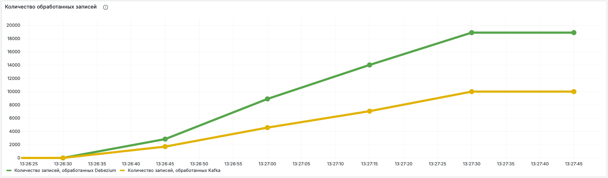

# Проект выпускной квалификационной работы бакалавриата
## Использование Debezium в веб-сервисе для реализации шаблона разработки захвата изменения данных
### Описание проекта
В качестве проекта реализовано два сервиса по обработке и аналитике выплат. Сервис по обработке принимает запросы от
пользователя и занимается созданием, изменением и удалением выплат. Сервис аналитики занимается подсчетом статистики
количества успешных и неуспешных выплат. Выполнено две реализации приложения: с использованием Apache Kafka и с 
использованием Debezium.
### Запуск проекта
Необходимо перейти в папку проекта и выполнить команду:
```shell
docker-compose up -d
```
### Просмотр результатов тестирования
При запуске производится автоматическое тестирование производительности. Чтобы увидеть дашборды, необходимо перейти
на [Grafana](http://localhost:3001), загрузить дашборду, которая находится в папке проекта, и увидеть результаты. 
Пример:
